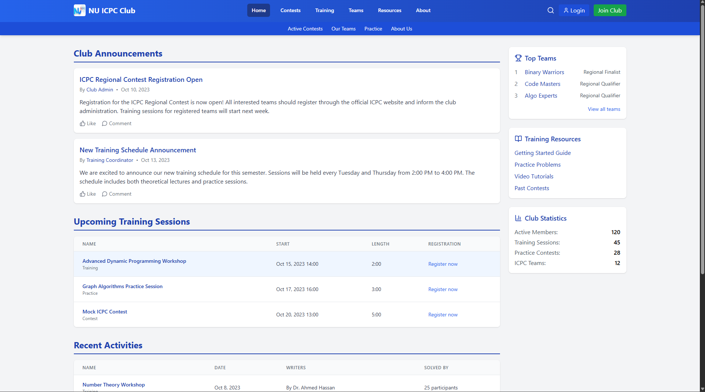
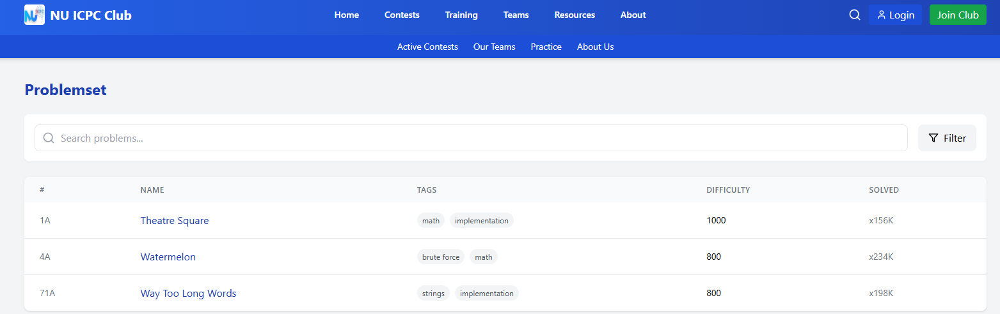
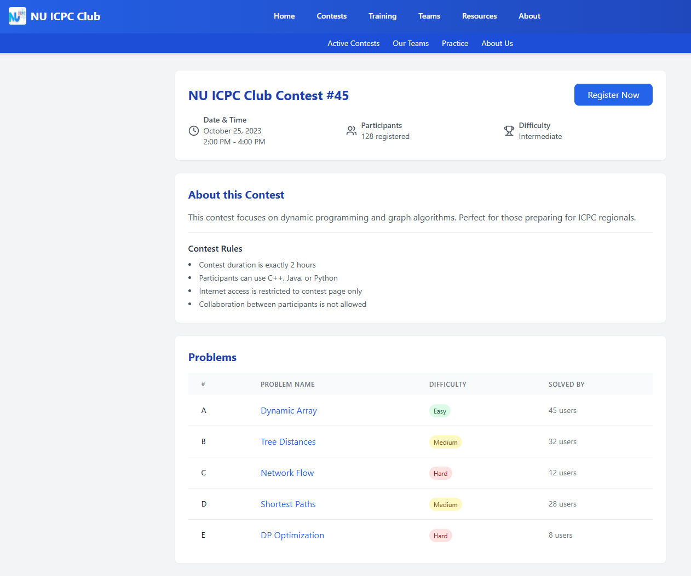
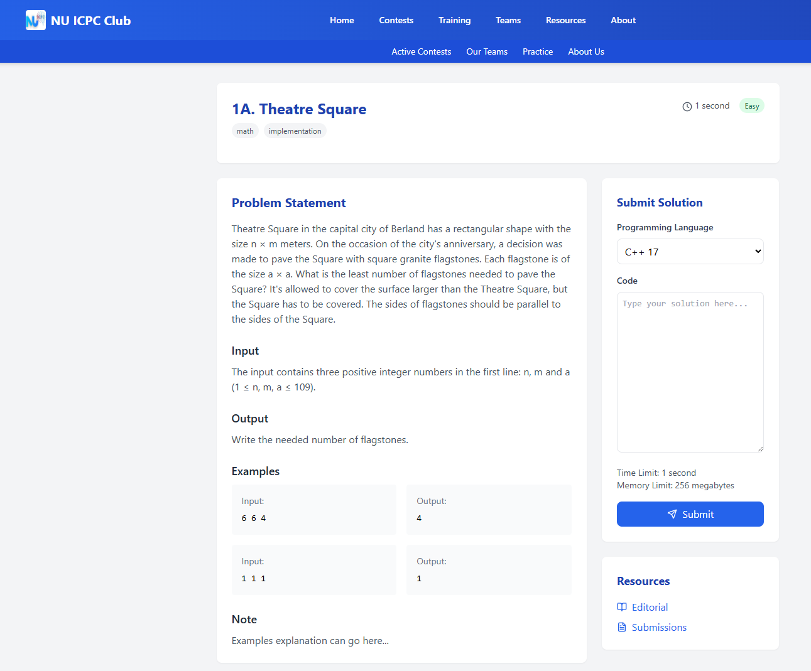

# 🏆 Nile University Competitive Programming

> A web platform designed to encourage Nile University students to practice problem-solving and participate in programming contests.


---

## 📸 Screenshots

### 🏠 Home / Dashboard


### 📋 Problem List


### ⚔️ Contest View


### 🧑‍💻 Code Editor


---

## 🛠️ Tech Stack

| Layer | Technology |
|---|---|
| Frontend | React + Vite |
| Styling | Tailwind CSS |
| Backend | Node.js |
| Database & Auth | Supabase |
| Judge | ZeroJudge API |

---

## ✨ Features

- 🔐 Secure authentication via Supabase
- 📚 Browse and solve problems with difficulty ratings
- ⚡ Real-time code execution via ZeroJudge
- 🏅 Contest creation, participation, and rankings
- 📊 Personal progress tracking

---

## 📁 Folder Structure

```
.
├── DB_Backend/              # Node.js backend
│   ├── icpcbackend/         # Core backend logic
│   ├── config/              # Configuration files
│   └── .env.example         # Environment variable template
└── DBfront/                 # React frontend
    └── src/                 # Source components & pages
```

---

## ⚙️ Setup

### Prerequisites

- Node.js v18+
- A [Supabase](https://supabase.com) project
- ZeroJudge running locally or remotely

### 1. Clone the repo

```bash
git clone https://github.com/Mhossam22/NUCPC.git
cd NUCPC
```

### 2. Configure environment variables

```bash
cp DB_Backend/.env.example DB_Backend/.env
```

Then fill in your values:

```env
PORT=3000
SUPABASE_URL=your_supabase_url
SUPABASE_KEY=your_supabase_anon_key
JUDGE0_URL=http://localhost:2358
ENABLE_ALL_LANGUAGES=true
```

### 3. Install dependencies

```bash
# Backend
cd DB_Backend && npm install

# Frontend
cd ../DBfront && npm install
```

---

## 🚀 Running the Project

### Frontend

```bash
cd DBfront
npm run dev
```

### Backend

```bash
cd DB_Backend
node index.js
```

The frontend runs on `http://localhost:5173` and the backend on `http://localhost:3000` by default.
